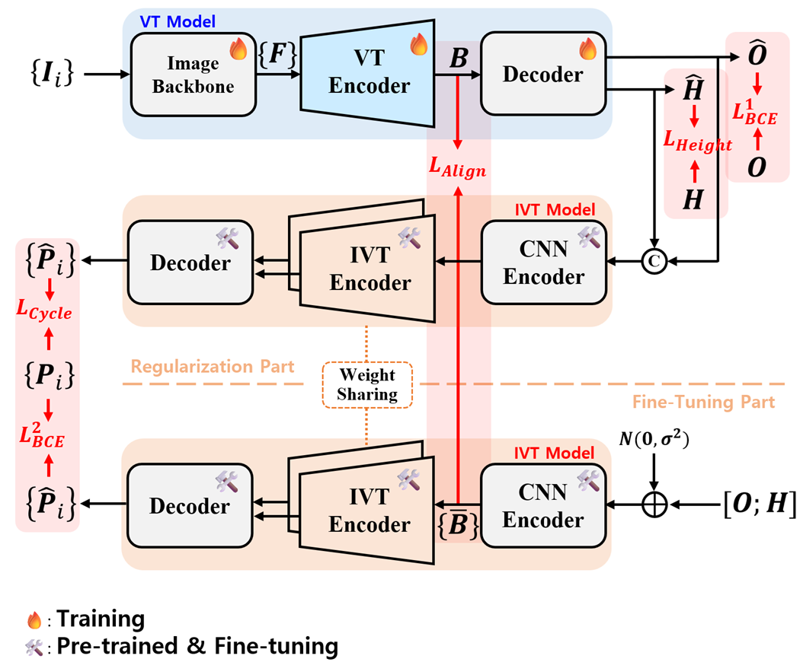

# CycleBEV: Regularizing View Transformation Networks via View Cycle Consistency for Bird’s-Eye-View Semantic Segmentation

## Abstract
Transforming image features from perspective view (PV) space to bird's-eye-view (BEV) space remains challenging in autonomous driving due to depth ambiguity and occlusion. Although several view transformation (VT) paradigms have been proposed, the challenge still remains. In this paper, we propose a new regularization framework, dubbed CycleBEV, that enhances existing VT models for BEV semantic segmentation. Inspired by cycle consistency, widely used in image distribution modeling, we devise an inverse view transformation (IVT) network that maps BEV segmentation maps back to PV segmentation maps and use it to regularize VT networks during training through cycle consistency losses, enabling them to capture richer semantic and geometric information from input PV images. To further exploit the capacity of the IVT network, we introduce two novel ideas that extend cycle consistency into geometric and representation spaces. We evaluate CycleBEV on four representative VT models covering three major paradigms using the large-scale nuScenes dataset. Experimental results show consistent improvements---with gains of up to **0.74**, **4.86**, and **3.74** mIoU for drivable area, vehicle, and pedestrian classes, respectively---without increasing inference complexity, since the IVT network is used only during training. 

## Methods
 </br>
Figure 3. Visualization of the proposed regularization framework.

## Preparation
- Environments </br>

- Dataset </br>
  - Download [nuScenes](https://www.nuscenes.org/) dataset and modify the **"dataset_dir" in ./config/config.json** </br>
  - Download [pseudo annotation](https://drive.google.com/drive/folders/1ZHWtf2xI3fY5_hJBpwpYvMOaigPUSCCI) for image segmentation and move it to **./nuscenes/v1.0-trainval/** in your nuscenes path. </br>

- Pretrained weights of IVT </br>
  Download the [pretrained checkpoints](https://drive.google.com/drive/folders/10Nfm69LMlvekKCMYbMmumhpMP01OyjaS) and move it to  **./saved_models/pretrained_ck/** </br>

- For BEVFormer, you have to do following:
```
source activate your_env
pip install packaging
pip install --upgrade setuptools
```
```
cd models/bevformer/ops/
python setup.py build install
```

## Train & Inference
```
./tools/train_cyclebev_cvt.sh
```

## Test
```
./tools/test_cyclebev_cvt.sh
```

## Acknowledgement


## Contact
